<div align="center">


<br>

<a href="https://play.google.com/store/apps/details?id=com.soundr.app"></a>

<br>


### *It started as a soundboard. Then it kept going.*

**145 sounds · 12 tools & games · zero ads · zero trackers · no internet permission.**

</div>

---

## 🎬 See it move

<table>
  <tr>
    <td align="center" width="25%">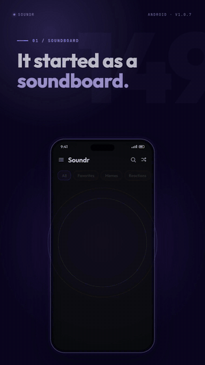<br><b>Tap. Boom. Measure.</b><br><sub>Vine Boom → 91 dB, “Safe for ~2 hours”</sub></td>
    <td align="center" width="25%">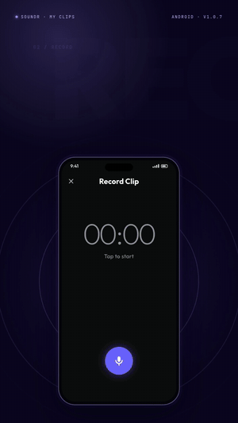<br><b>Turn anything into a button</b><br><sub>Record → trim → name → tap</sub></td>
    <td align="center" width="25%">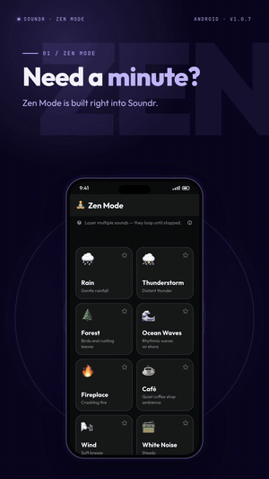<br><b>Find your calm</b><br><sub>Rain + forest + fireplace, layered</sub></td>
    <td align="center" width="25%">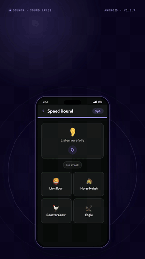<br><b>Can you beat 31?</b><br><sub>Speed Round · Pair Match</sub></td>
  </tr>
</table>

---

## 🎛️ What's inside

<table>
  <tr>
    <td width="33%" valign="top">
      <h3>🔊 Soundboard</h3>
      145 built-in sounds across 11 categories: memes, reactions, effects, gaming, cartoons, animals and more. Favourites, custom <b>boards</b>, search, play counts, stop-on-tap, and a playback notification with quick-play buttons.
    </td>
    <td width="33%" valign="top">
      <h3>🎙️ My Clips</h3>
      Record or import your own audio, trim it on a live waveform, pick an icon and colour, and it becomes a button. Share it anywhere.
    </td>
    <td width="33%" valign="top">
      <h3>🧘 Zen Mode</h3>
      19 looping ambient sounds: rain, thunder, forest, ocean, café, fireplace and cosmic pads. Layer them, set each level from 1–100, save up to 10 mixes, and track your listening streak.
    </td>
  </tr>
  <tr>
    <td valign="top">
      <h3>📊 Decibel Meter</h3>
      Live dB readings with optional <b>A-weighting</b>, calibration, peak hold, a 60-second history, threshold alerts, and NIOSH-based “safe for how long?” guidance. Save and share sessions as CSV.
    </td>
    <td valign="top">
      <h3>📈 Spectrum Analyser</h3>
      A real-time FFT split into 24 log-spaced bands from 60 Hz to 16 kHz. See whether it's a low rumble or a high whine.
    </td>
    <td valign="top">
      <h3>🎵 Metronome</h3>
      40–240 BPM, tap tempo, four time signatures (2/4, 3/4, 4/4, 6/8), an accented downbeat, and tempo names from <i>Largo</i> to <i>Prestissimo</i>.
    </td>
  </tr>
  <tr>
    <td valign="top">
      <h3>👂 Hearing Check</h3>
      Ten tones from 250 Hz to 16 kHz estimate your “auditory age” from presbycusis norms, with a mini audiogram. <i>For curiosity, not medicine.</i>
    </td>
    <td valign="top">
      <h3>📡 Morse Code</h3>
      A tapper that decodes dots and dashes as you hold, a Soundr that plays any text as Morse (with speed and practice mode), and two quiz games.
    </td>
    <td valign="top">
      <h3>🎮 Sound Games</h3>
      <b>Speed Round</b>: name the sound in 5 seconds and build streak multipliers. <b>Pair Match</b>: flip cards and match pairs by ear, on three difficulties.
    </td>
  </tr>
</table>

<p align="center"><sub>…plus <b>Voice Memos</b> with scrubbable waveforms, a <b>haptics</b> toggle, light/dark themes and accent colours.</sub></p>

---

## 📱 Screenshots

<p align="center">
  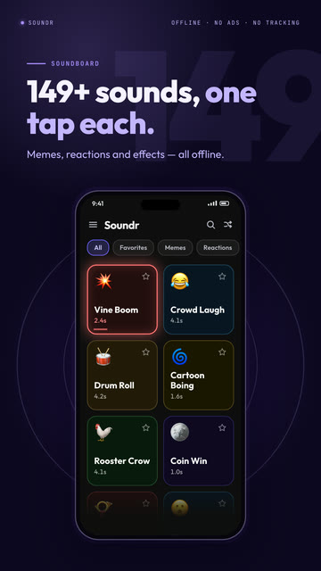
  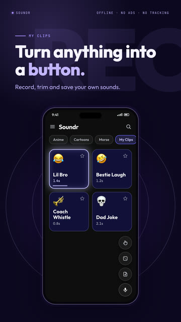
  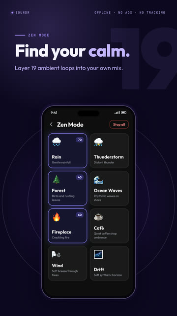
  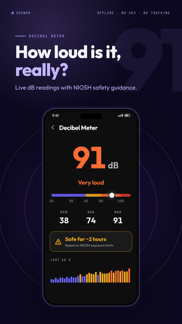
</p>
<p align="center">
  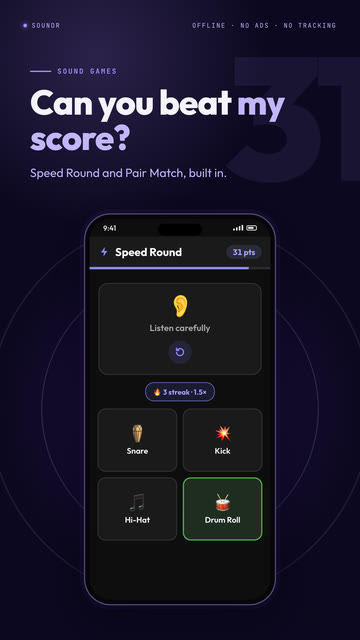
  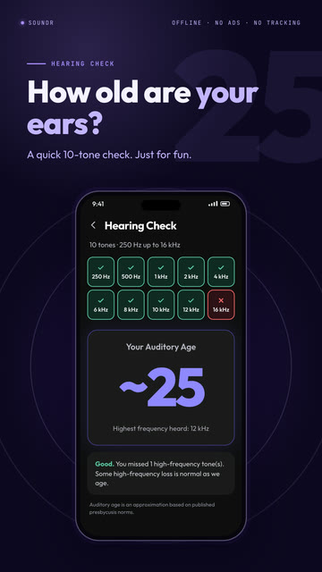
  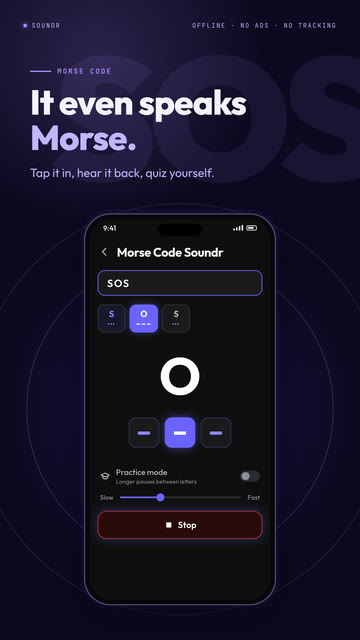
  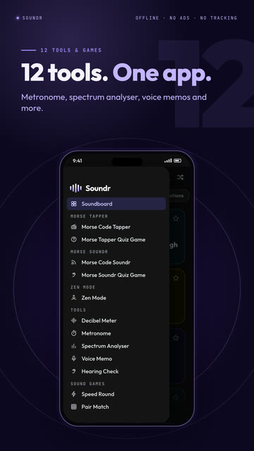
</p>

---

## 🔒 The manifest is the privacy policy

Soundr doesn't just *promise* to stay offline. The release build **can't reach the internet**, because the permission was never requested. Two permissions that dependencies try to merge in are **explicitly stripped**:

| Permission | Status | Why |
|---|:---:|---|
| `RECORD_AUDIO` | ✅ requested | Decibel meter, spectrum, voice memos, custom clips. Audio is processed on-device and never transmitted. |
| `POST_NOTIFICATIONS` | ✅ requested | The playback notification with Stop and quick-play buttons. |
| `INTERNET` | 🚫 **absent** | Only debug/profile builds get it (for hot reload). Release builds have no network access. |
| `ACCESS_NETWORK_STATE` | ✂️ **removed** | Declared by a transitive media dependency, and stripped with `tools:node="remove"`. |
| `RECEIVE_BOOT_COMPLETED` | ✂️ **removed** | Merged in by `flutter_local_notifications`. Soundr never schedules notifications, so it's stripped. |

No accounts, no analytics SDKs, no ads. Favourites, clips, stats and mixes live in a local SQLite database and app storage. See [`PRIVACY_POLICY.md`](PRIVACY_POLICY.md).

---

## 🧪 Under the hood

Everything here is real signal processing, running on the phone:

| Feature | How it works |
|---|---|
| **Audio engine** | [`flutter_soloud`](https://pub.dev/packages/flutter_soloud) with every sound preloaded as an in-memory `AudioSource` for instant, overlapping playback. |
| **Decibel meter** | 44.1 kHz PCM16 stream → optional **IEC 61672 A-weighting** (bilinear-transformed, 4-section biquad cascade) → RMS over 500 ms bins → $L = 20\log_{10}(\text{RMS}) + 94 + \text{cal}$. Peak hold is 2 s, then decays at 6 dB/s. |
| **Safe-exposure guidance** | NIOSH 3 dB exchange rate from an 85 dB, 8-hour baseline: $t = \dfrac{8}{2^{(L-85)/3}}$ hours. |
| **Spectrum** | 2048-point in-place **radix-2 Cooley–Tukey FFT** with a Hann window and 50% overlap → 24 log-spaced bands (60 Hz–16 kHz) → fast attack, 0.82 decay. |
| **Hearing check** | Synthesised 2 s sine tones with 50 ms fades. The highest frequency you hear maps to an estimated auditory age via an ISO 7029-style lookup. |
| **Metronome** | Synthesised decaying sine clicks (1 kHz, with a 1.5 kHz accent). Tap tempo averages your last 8 taps. |
| **Recording** | Raw PCM16 stream → live RMS meter → a hand-built RIFF/WAV header, no encoder dependency. |
| **Speed Round** | $\text{points} = \max\!\left(1, \operatorname{round}\!\left(\tfrac{t_{\text{left}}}{5}\cdot 10\right)\right) \times \{1,\ 1.5,\ 2\}$, with the multiplier kicking in at 3- and 7-answer streaks. |

### Architecture

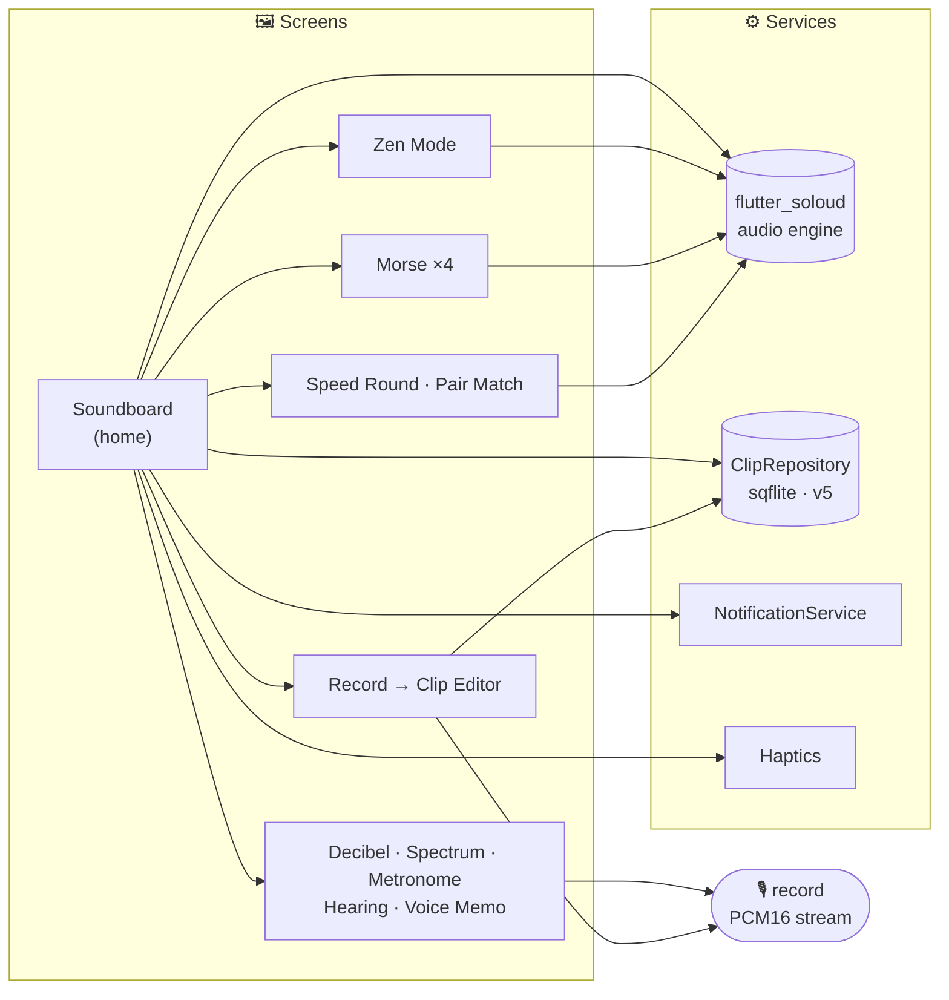

<details>
<summary><b>📂 Project structure</b></summary>

```text
lib/
├── main.dart                     # App root: theme + accent notifiers, Material 3, Outfit font
├── data/sounds_data.dart         # The 145 built-in sounds
├── models/                       # SoundModel, SceneModel (boards)
├── services/
│   ├── clip_repository.dart      # sqflite: clips, favourites, play counts, boards, settings
│   ├── notification_service.dart # Playback notification + quick-play actions
│   └── haptics.dart              # App-wide haptics gate (user-toggleable)
├── theme/app_colors.dart         # Semantic light/dark colour tokens (ThemeExtension)
├── widgets/                      # SoundButton, PermissionDeniedCard
└── screens/                      # 15 screens: soundboard, tools, zen, morse, games, editor…
assets/
├── sounds/raw/                   # Soundboard audio
├── sounds/zen/                   # 19 ambient loops
└── fonts/Outfit-VariableFont.ttf # Bundled font, no runtime download
```

</details>

---

## 🚀 Getting started

```bash
# Flutter 3.41+ / Dart 3.11+
git clone https://github.com/prahuljose/soundr_soundboard.git
cd soundr_soundboard
flutter pub get
flutter run                          # on a connected Android device or emulator
flutter build appbundle --release    # Play Store bundle
```

> [!NOTE]
> Release signing reads `android/key.properties`, which is git-ignored. Without it, build a debug APK with `flutter build apk --debug`.

---

## 🗺️ Roadmap

- [x] Haptics toggle, screen-reader labels on sound buttons, URL-import size cap, ad-safe sound names ([#1](https://github.com/prahuljose/soundr_soundboard/pull/1))
- [ ] Share **any** sound straight to WhatsApp / Discord / Instagram
- [ ] Home-screen widget + Quick Settings tile for favourites
- [ ] Bottom navigation, so the tools stop hiding in the drawer
- [ ] Zen sleep timer with fade-out
- [ ] Shareable score cards and personal bests for the games
- [ ] Set any sound as a ringtone or notification sound
- [ ] Remember theme and accent between launches
- [ ] Lazy-load sounds for a near-instant cold start

---

## 🎬 Made with `/brag`

The demo GIFs above, the launch videos and the Play Store screenshots were generated **from this codebase**. The [/brag](https://github.com/latent-spaces/brag) Claude Code skill and [Hyperframes](https://github.com/heygen-com/hyperframes) recreated each screen from the Flutter source, down to the real scoring maths and colour tokens, and scored the videos with the app's own sounds.

<sub>Promo-video music: “Happy Beats / Business Moves” by ende.app. UI SFX in the videos: Kenney (CC0). Font: [Outfit](https://fonts.google.com/specimen/Outfit) (SIL OFL). None of these ship in the app except Outfit.</sub>

---

<div align="center">
  
  <sub>© Soundr. All rights reserved: this repository doesn't include an open-source licence.</sub>
</div>
