<div align="center">



<br>

<a href="https://play.google.com/store/apps/details?id=com.soundr.app"></a>

<br>


### *It started as a soundboard. Then it kept going.*

**149 sounds · 17 tools & games · zero ads · zero trackers · no internet permission.**

</div>

---

## 🎬 See it move

<table>
  <tr>
    <td align="center" width="25%">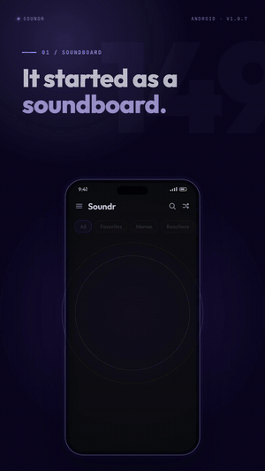<br><b>Tap. Boom. Measure.</b><br><sub>Vine Boom → 91 dB, “Safe for ~2 hours”</sub></td>
    <td align="center" width="25%">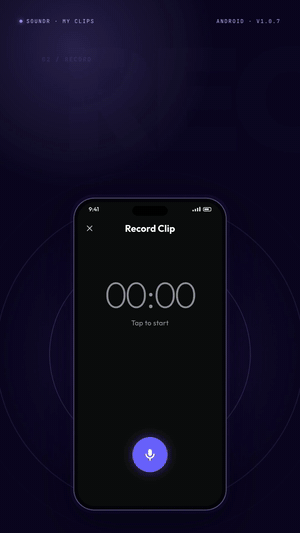<br><b>Turn anything into a button</b><br><sub>Record → trim → name → tap</sub></td>
    <td align="center" width="25%">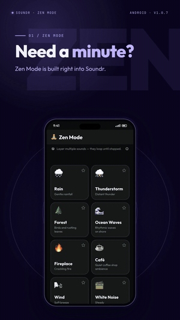<br><b>Find your calm</b><br><sub>Rain + forest + fireplace, layered</sub></td>
    <td align="center" width="25%">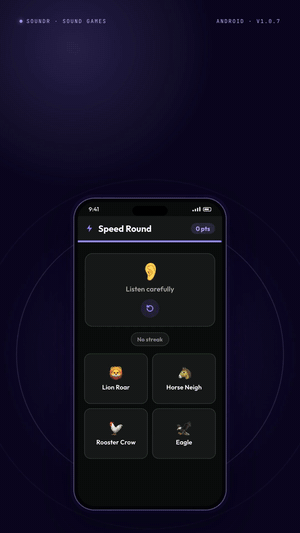<br><b>Can you beat 31?</b><br><sub>Speed Round · Pair Match</sub></td>
  </tr>
</table>

---

## 🎛️ What's inside

Four tabs: **Sounds · Tools · Games · Settings**, on a floating, frosted tab bar. Prefer the old side menu? It's one switch away in Settings.

### 🔊 Sounds

<table>
  <tr>
    <td width="33%" valign="top">
      <h3>🔊 Soundboard</h3>
      149 built-in sounds across 11 categories: memes, reactions, effects, gaming, cartoons, animals and more. Favourites, custom <b>boards</b>, search, play counts and a playback notification. Long-press any sound to <b>share</b> it, <b>loop</b> it, change its <b>speed</b> (0.5×–2×) or pin it to the widget.
    </td>
    <td width="33%" valign="top">
      <h3>🎙️ My Clips</h3>
      Record or import your own audio, trim it on a live waveform that lights up as it plays, pick an emoji and colour, and it becomes a button. Share it anywhere.
    </td>
    <td width="33%" valign="top">
      <h3>📲 Home-screen widget</h3>
      Up to 8 sounds on your home screen, each with a mini waveform in its colour. Tap to play without opening the app, with a Stop button. Choose the sounds yourself, or let it pick your favourites.
    </td>
  </tr>
</table>

### 🛠️ Tools

<table>
  <tr>
    <td width="33%" valign="top">
      <h3>🧘 Zen Mode</h3>
      19 looping ambient sounds to layer, with a mixer for each level, saved mixes, a <b>sleep timer</b> that fades out gently, and smooth fades on pause and stop. Pick up your last mix from the Tools tab.
    </td>
    <td width="33%" valign="top">
      <h3>🎸 Guitar Tuner</h3>
      Pluck any string and it finds it. A gliding cents needle turns green when you're in tune. Tap a peg to hear the string's note. Includes 8 tunings (Standard, Drop D, DADGAD…), chromatic mode and A4 calibration.
    </td>
    <td width="33%" valign="top">
      <h3>〰️ Tone Generator & Pitch Pipe</h3>
      20 Hz–20 kHz on a log dial, with sine, square, triangle and saw waves, a live oscilloscope and a sweep. Plus a round 12-note pitch pipe with octaves.
    </td>
  </tr>
  <tr>
    <td valign="top">
      <h3>🎵 Metronome</h3>
      40–240 BPM, beat dots that follow the click, hold-to-repeat −/+, tap tempo, four time signatures and tempo names from <i>Largo</i> to <i>Prestissimo</i>.
    </td>
    <td valign="top">
      <h3>🤖 Voice Changer</h3>
      Record up to 15 s, then tap through 12 voices: Chipmunk, Helium, Deep, Monster, Robot, Alien, Echo, Stadium, Radio, Underwater, Backwards. Share it or add it to the soundboard.
    </td>
    <td valign="top">
      <h3>📝 Voice Memos</h3>
      Quick recordings with drag-to-seek waveforms, 1×/1.5×/2× playback, search, and one tap to turn a memo into a soundboard button.
    </td>
  </tr>
  <tr>
    <td valign="top">
      <h3>📊 Decibel Meter</h3>
      Live dB with optional <b>A-weighting</b>, calibration, min/avg/max, a 30-second chart with an 85 dB line, and NIOSH-based “safe for how long?” guidance. Save sessions and share them as CSV.
    </td>
    <td valign="top">
      <h3>📈 Spectrum Analyser</h3>
      A real-time FFT from 60 Hz to 16 kHz. Shows the loudest frequency with its musical note and held peaks, with Freeze and Share snapshot.
    </td>
    <td valign="top">
      <h3>👂 Hearing Check</h3>
      Tones from 250 Hz to 16 kHz estimate your “auditory age”, with an optional left/right ear test and a shareable result card. <i>For curiosity, not medicine.</i>
    </td>
  </tr>
  <tr>
    <td valign="top">
      <h3>💧 Speaker Cleaner</h3>
      <b>Water</b> mode plays 165–180 Hz pulses, the same idea as Apple Watch's Water Lock. <b>Dust</b> mode plays a 200–1500 Hz sweep. Choose Quick, Normal or Deep.
    </td>
    <td valign="top">
      <h3>📡 Morse Code</h3>
      A tapper that decodes as you tap, and a Soundr that plays any text as Morse. Both can also <b>flash</b> the torch or <b>vibrate</b> as options.
    </td>
    <td valign="top"></td>
  </tr>
</table>

### 🎮 Games

<table>
  <tr>
    <td width="33%" valign="top">
      <h3>⚡ Speed Round</h3>
      Name the sound before the ring runs out, with streak multipliers. Answers show their emoji, and a wrong pick reveals the right one.
    </td>
    <td width="33%" valign="top">
      <h3>🃏 Pair Match</h3>
      Flip cards and match pairs by ear, on three difficulties.
    </td>
    <td width="33%" valign="top">
      <h3>🔁 Reverse Challenge</h3>
      Say a phrase, then copy it backwards. Your attempt gets flipped and scored 0–100 against the original.
    </td>
  </tr>
</table>

<p align="center"><sub>…plus two <b>Morse quiz</b> games, shareable score cards and personal bests, Dark / Light / System themes with accent colours (remembered), three button sizes, haptics and a first-run tour.</sub></p>

---

## 📱 Screenshots

<sub>From v1.0. The 1.1 redesign and the new tools aren't pictured yet.</sub>

<p align="center">
  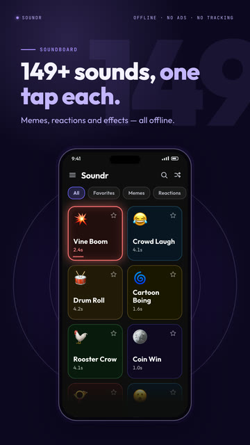
  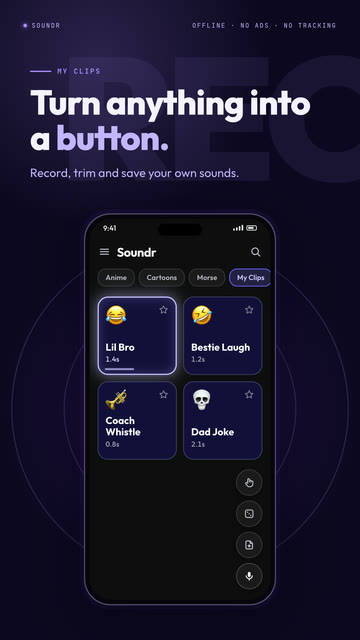
  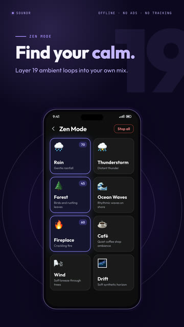
  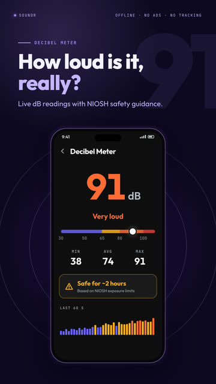
</p>
<p align="center">
  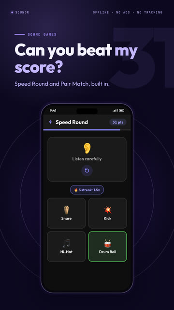
  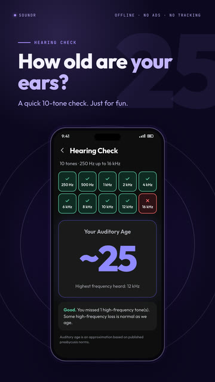
  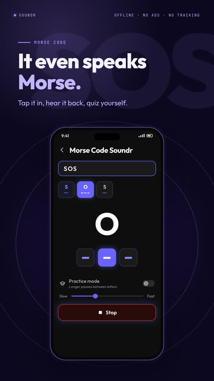
  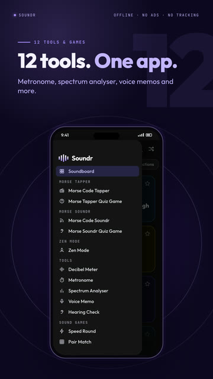
</p>

---

## 🔒 The manifest is the privacy policy

Soundr doesn't just *promise* to stay offline. The release build **can't reach the internet**, because the permission was never requested. Two permissions that dependencies try to merge in are **explicitly stripped**:

| Permission | Status | Why |
|---|:---:|---|
| `RECORD_AUDIO` | ✅ requested | Decibel meter, spectrum, guitar tuner, voice memos and changer, Reverse Challenge, custom clips. Audio is processed on-device and never transmitted. |
| `POST_NOTIFICATIONS` | ✅ requested | The playback notification with Stop and quick-play buttons. |
| `VIBRATE` | ✅ requested | Haptics, and Morse code as vibration. The Morse torch uses `setTorchMode`, which needs no camera permission. |
| `INTERNET` | 🚫 **absent** | Only debug/profile builds get it (for hot reload). Release builds have no network access. |
| `ACCESS_NETWORK_STATE` | ✂️ **removed** | Declared by a transitive media dependency, and stripped with `tools:node="remove"`. |
| `RECEIVE_BOOT_COMPLETED` | ✂️ **removed** | Merged in by `flutter_local_notifications`. Soundr never schedules notifications, so it's stripped. |

No accounts, no analytics SDKs, no ads. Favourites, clips, stats and mixes live in a local SQLite database and app storage. See [`PRIVACY_POLICY.md`](PRIVACY_POLICY.md).

---

## 🧪 Under the hood

Everything here is real signal processing, running on the phone:

| Feature | How it works |
|---|---|
| **Audio engine** | [`flutter_soloud`](https://pub.dev/packages/flutter_soloud) with every sound preloaded as an in-memory `AudioSource` for instant, overlapping playback. |
| **Decibel meter** | 44.1 kHz PCM16 stream → optional **IEC 61672 A-weighting** (bilinear-transformed, 4-section biquad cascade) → RMS over 500 ms bins → $L = 20\log_{10}(\text{RMS}) + 94 + \text{cal}$. Peak hold is 2 s, then decays at 6 dB/s. |
| **Safe-exposure guidance** | NIOSH 3 dB exchange rate from an 85 dB, 8-hour baseline: $t = \dfrac{8}{2^{(L-85)/3}}$ hours. |
| **Spectrum** | 2048-point in-place **radix-2 Cooley–Tukey FFT** with a Hann window and 50% overlap → 40 log-spaced bands (60 Hz–16 kHz) → fast attack, 0.82 decay, with held peaks. |
| **Hearing check** | Synthesised 2 s sine tones with 50 ms fades. The highest frequency you hear maps to an estimated auditory age via an ISO 7029-style lookup. |
| **Metronome** | Synthesised decaying sine clicks (1 kHz, with a 1.5 kHz accent). Tap tempo averages your last 8 taps. |
| **Recording** | Raw PCM16 stream → live RMS meter → a hand-built RIFF/WAV header, no encoder dependency. |
| **Guitar tuner** | **YIN** pitch detection (de Cheveigné & Kawahara) on 2:1-downsampled mic audio: a cumulative-mean-normalised difference, the first dip under 0.15, and parabolic interpolation. A median filter, a −20 dB note-tail gate and 2-frame confirmation of new notes keep the needle steady. Tested within 2 cents on synthetic plucked strings from C2 to A5, at about 1% CPU. |
| **Voice changer** | Pure-Dart DSP, rendered off the UI thread: pitch shift that keeps the length (overlap-add time-stretch, then a low-passed resample), ring modulation, Schroeder reverb, feedback echo, a telephone band-pass with soft clipping, and vibrato. |
| **Reverse Challenge score** | Silence is trimmed, then 20 ms frames are compared on loudness, 9-band spectral shape and zero-crossing rate. They're aligned with **dynamic time warping**, so speaking faster or slower doesn't count against you, and the length-normalised distance maps to 0–100. |
| **Tone generator** | SoLoud waveform voices that glide when retuned, a log-scale dial, and 40 ms fades so nothing clicks. |
| **Speaker cleaner** | Generated programs: a 160–180 Hz sine in 0.9 s pulses (water), or 200→1500→200 Hz log sweeps (dust). Both render in a background isolate. |
| **Speed Round** | $\text{points} = \max\left(1,\ \mathrm{round}\left(\frac{t_{\text{left}}}{5}\cdot 10\right)\right) \times \lbrace 1,\ 1.5,\ 2 \rbrace$, with the multiplier kicking in at 3- and 7-answer streaks. |

### Architecture

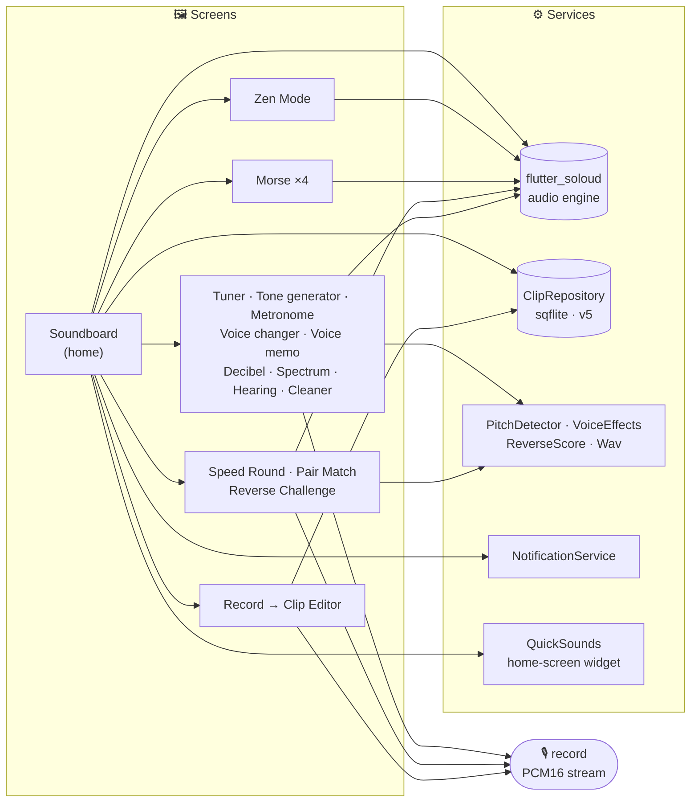
```mermaid
flowchart LR
    subgraph UI["🖼️ Screens"]
        SB["Soundboard<br/>(home)"]
        TOOLS["Tuner · Tone generator · Metronome<br/>Voice changer · Voice memo<br/>Decibel · Spectrum · Hearing · Cleaner"]
        ZEN["Zen Mode"]
        MORSE["Morse ×4"]
        GAMES["Speed Round · Pair Match<br/>Reverse Challenge"]
        EDIT["Record → Clip Editor"]
    end
    subgraph CORE["⚙️ Services"]
        SOLOUD[("flutter_soloud<br/>audio engine")]
        REPO[("ClipRepository<br/>sqflite · v5")]
        DSP["PitchDetector · VoiceEffects<br/>ReverseScore · Wav"]
        NOTIF["NotificationService"]
        WIDGET["QuickSounds<br/>home-screen widget"]
    end
    MIC(["🎙️ record<br/>PCM16 stream"])
    SB --> SOLOUD & REPO & NOTIF & WIDGET
    SB --> TOOLS & ZEN & MORSE & GAMES & EDIT
    EDIT --> REPO
    TOOLS & GAMES & EDIT --> MIC
    TOOLS & GAMES --> DSP
    ZEN & MORSE & GAMES & TOOLS --> SOLOUD
```

<details>
<summary><b>📂 Project structure</b></summary>

```text
lib/
├── main.dart                     # App root: theme + accent notifiers, Material 3, Outfit font
├── data/sounds_data.dart         # The 149 built-in sounds
├── models/                       # SoundModel, SceneModel (boards)
├── services/
│   ├── clip_repository.dart      # sqflite: clips, favourites, play counts, boards, settings
│   ├── app_settings.dart         # Theme, accent, button size, menu style (persisted)
│   ├── pitch_detector.dart       # YIN pitch detection (tuner, scoring)
│   ├── guitar_tuning.dart        # Tunings, note maths, the tuner engine
│   ├── voice_effects.dart        # Voice changer DSP
│   ├── reverse_score.dart        # Reverse Challenge scoring (DTW)
│   ├── wav.dart · mic_clip_recorder.dart · clip_player.dart
│   ├── quick_sounds.dart         # Home-screen widget sync
│   └── notification_service.dart # Playback notification + quick-play actions
├── theme/app_colors.dart         # Semantic light/dark colour tokens (ThemeExtension)
├── widgets/                      # Sound button & sheet, share cards, per-tool widgets
└── screens/                      # 23 screens: soundboard, hubs, tools, zen, morse, games…
android/…/kotlin/com/soundr/app/  # Home-screen widget, torch & vibration channels
test/                             # Unit + widget tests, incl. synthetic-audio DSP tests
assets/
├── sounds/raw/                   # Soundboard audio
├── sounds/zen/                   # 19 ambient loops
└── fonts/Outfit-VariableFont.ttf # Bundled font, no runtime download
```

</details>

---

## 🚀 Getting started

```bash
# Flutter 3.41+ / Dart 3.11+
git clone https://github.com/prahuljose/soundr_soundboard.git
cd soundr_soundboard
flutter pub get
flutter run                          # on a connected Android device or emulator
flutter build appbundle --release    # Play Store bundle
```

> [!NOTE]
> Release signing reads `android/key.properties`, which is git-ignored. Without it, build a debug APK with `flutter build apk --debug`.

---

## 🗺️ Roadmap

- [x] Haptics toggle, screen-reader labels on sound buttons, URL-import size cap, ad-safe sound names ([#1](https://github.com/prahuljose/soundr_soundboard/pull/1))
- [x] Share **any** sound straight to WhatsApp / Discord / Instagram
- [x] Home-screen widget, with your choice of sounds
- [x] Bottom navigation, now the default, on a floating tab bar
- [x] Zen sleep timer with fade-out
- [x] Shareable score cards and personal bests for the games
- [x] Remember theme and accent between launches
- [x] Guitar tuner, tone generator, voice changer, speaker cleaner, Reverse Challenge
- [ ] Set any sound as a ringtone or notification sound
- [ ] Ukulele and bass tunings for the tuner
- [ ] Lazy-load sounds for a near-instant cold start

---

## 🎬 Made with `/brag`

The demo GIFs above, the launch videos and the Play Store screenshots were generated **from this codebase**. The [/brag](https://github.com/latent-spaces/brag) Claude Code skill and [Hyperframes](https://github.com/heygen-com/hyperframes) recreated each screen from the Flutter source, down to the real scoring maths and colour tokens, and scored the videos with the app's own sounds.

<sub>Promo-video music: “Happy Beats / Business Moves” by ende.app. UI SFX in the videos: Kenney (CC0). Font: [Outfit](https://fonts.google.com/specimen/Outfit) (SIL OFL). None of these ship in the app except Outfit.</sub>

---

<div align="center">
  
  <sub>© Soundr. All rights reserved: this repository doesn't include an open-source licence.</sub>
</div>
